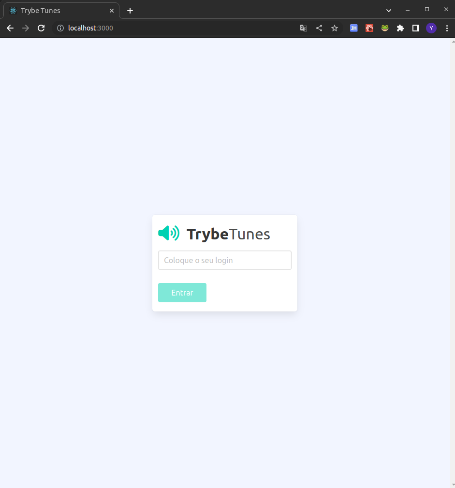
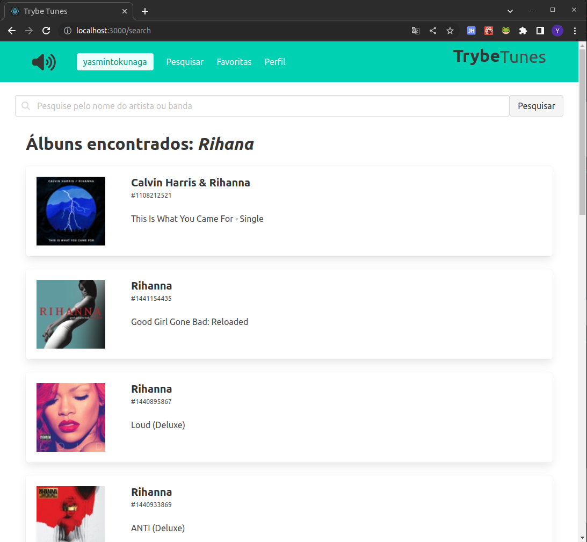
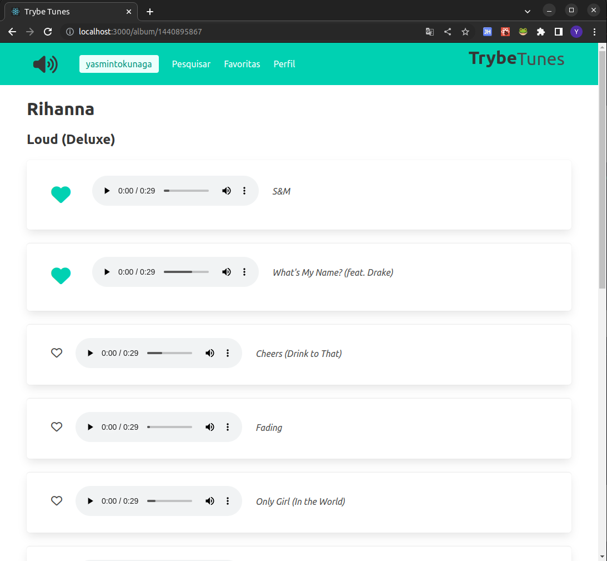
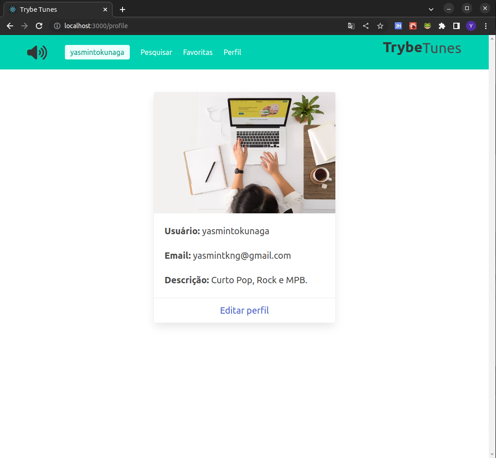
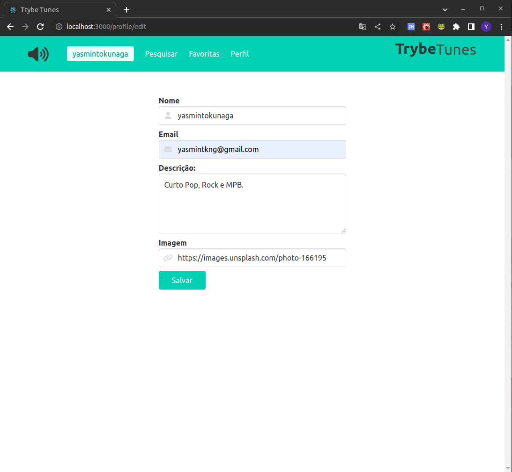

# Projeto Trybe Tunes

Projeto realizado durante o curso de Desenvolvimento Web na Trybe em Março, 2023.

# Conhecimentos técnicos utilizados: 

* HTML,
* CSS, 
* JavaScript (Fazer requisições e consumir os dados de uma API,
* React (manipulação dos estados de um componente, utilizar ciclos de vida do componente, transmitir informações entre componentes, , criação de rotas via Route, utilizar o Switch do React Router, criar links de navegação na aplicação com o componente `Link`, capturar eventos, criar formulários com a sintaxe JSX),
* Biblioteca bulma.io

# Objetivo:

Uma plataforma de músicas, com páginas de: Login, Busca, Lista de álbuns e músicas, Favoritas, Perfil e Edição de perfil.

# Requisitos:

* Criação das rotas
* Criação do formulário de login
* Inclusão do Header com barra de navegação
* Criação do formulário de pesquisa
* Requisição via API dos álbuns
* Criação da lista de músicas
* Adicionar as músicas favoritas
* Criação do perfil e da página de edição do perfil

# Resultado:

* Login

* Busca

* Lista de músicas

* Perfil

* Edição de perfil

